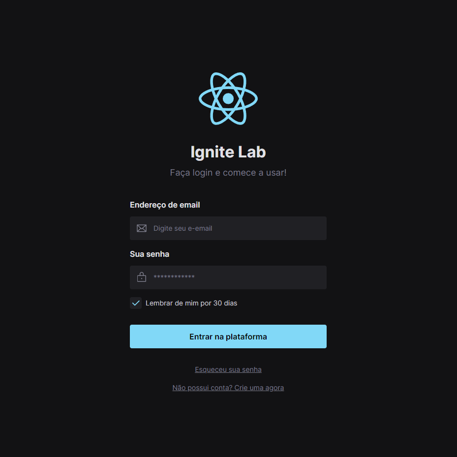

<p align="center">
  
</p>

<p align="center">
  <a href="#-Tecnologias">Tecnologias</a>&nbsp;&nbsp;&nbsp;|&nbsp;&nbsp;&nbsp;
  <a href="#-Sobre">Sobre</a>&nbsp;&nbsp;&nbsp;|&nbsp;&nbsp;&nbsp;
  <a href="#-Licença">Licença</a>
</p>

<p align="center">
  
</p>

<br>

## 🖥 Preview 

<p align="center">
  
</p>


<h4 align="center"> 
	🚧 Ignite Lab #3 - Projeto Finalizado 🚀 🚧
</h4>

## 🚀 Tecnologias

Esse projeto foi desenvolvido com as seguintes tecnologias:
-   **[Vite](https://vitejs.dev/)**
-   **[TypeScript](https://www.typescriptlang.org/)**
-   **[React](https://reactjs.org)**
-   **[Figma](https://www.figma.com)**
-   **[Storybook](https://storybook.js.org/)** 
-   **[Tailwind](https://tailwindcss.com/)**
-   **[Radix](https://expressjs.com/en/resources/middleware/cors.html)**

## 📖 Sobre 

Este é um projeto desenvolvido durante a terceira edição do **[Ignite Lab](https://lp.rocketseat.com.br/inscricao/ignite-lab)**, realizada pela **[@Rocketseat](https://github.com/Rocketseat)** durante os dias 10 a 12 de Outubro de 2022.

## 💻 Sobre o projeto

A proposta do projeto é construir um Design System do Figma até o React. Criando uma base visual no Figma, definindo quais tokens serão utilizados, além da criação dos componentes que farão parte da biblioteca em React. 
Exportaremos os tokens e componentes do Figma para o código criando a base do projeto em React e a documentação utilizando Storybook.
Finalizaremos o projeto com testes automatizados no Design System, simulando interações do usuário. Além disso, vamos automatizar o processo de deploy. 🚀

### Pré-requisitos

Antes de começar, você vai precisar ter instalado em sua máquina as seguintes ferramentas:
[Git](https://git-scm.com), [Node.js](https://nodejs.org/en/). 
Além disto é bom ter um editor para trabalhar com o código como [VSCode](https://code.visualstudio.com/)

#### 🧭 Rodando a aplicação 
```bash

# Clone este repositório
$ git clone https://github.com/Juliolatorre/ignite-lab3-design-system

# Acesse o projeto no seu terminal/cmd e Instale as dependências
$ npm install

# Execute a aplicação em modo de desenvolvimento
$ npm run dev

# A aplicação será aberta na porta:5173 - acesse http://localhost:5173

```

## Saiba mais

Você quer saber mais sobre Create React App, clique em [Create React App documentação](https://facebook.github.io/create-react-app/docs/getting-started).

Para aprender React, veja a sua documentação em [Documentação do React](https://reactjs.org/).

## 📝 Licença

Este projeto esta sobe a licença [MIT](./LICENSE).

---

Desenvolvido com 💜 por Júlio Latorre